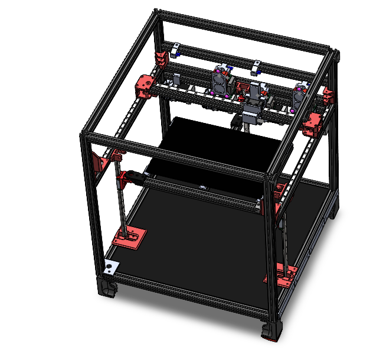

# SimpleCore Toolchanger

PLEASE NOTE THIS PRINTER IS A WORK IN PROGRESS!

This printer is a heavily modified version of Rolohaun's SimpleCore. This printer was also inspired by the Voron Trident.
Features:
300x200x200 volume
4 tools
belted z
auto tramming
mechanical probe
fully enclosed
separate electronics bay
